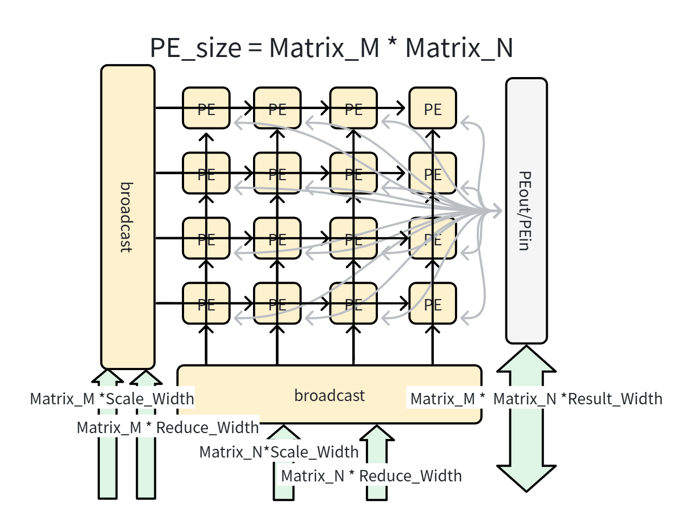

# 计算引擎

CUTE 的计算引擎由 MatrixTE（矩阵张量引擎）及其内部的 FPE（浮点运算引擎）组成，采用外积数据流和双流架构（Flow 1 标准多精度 + Flow 2 E2M1 高吞吐），支持从 INT8 到 FP32 以及 MXFP/NVFP 等 13 种数据类型。

## 模块总览

## 导航

- [Matrix Tensor Engine (MTE)](mte.md) — PE 阵列结构、外积数据流、ScaleA/ScaleB 接口、FPE 四阶段总览
- [FPE 浮点运算引擎](reduce-pe.md) — 四阶段逻辑架构（A/B/C/D）、Flow 1/Flow 2 双流、RawFloat 统一格式、CmpTree 指数比较、27-bit 对齐、RNE 舍入、硬件复用策略
- [后处理操作](after-ops.md) — ReLU、激活函数等计算后处理
