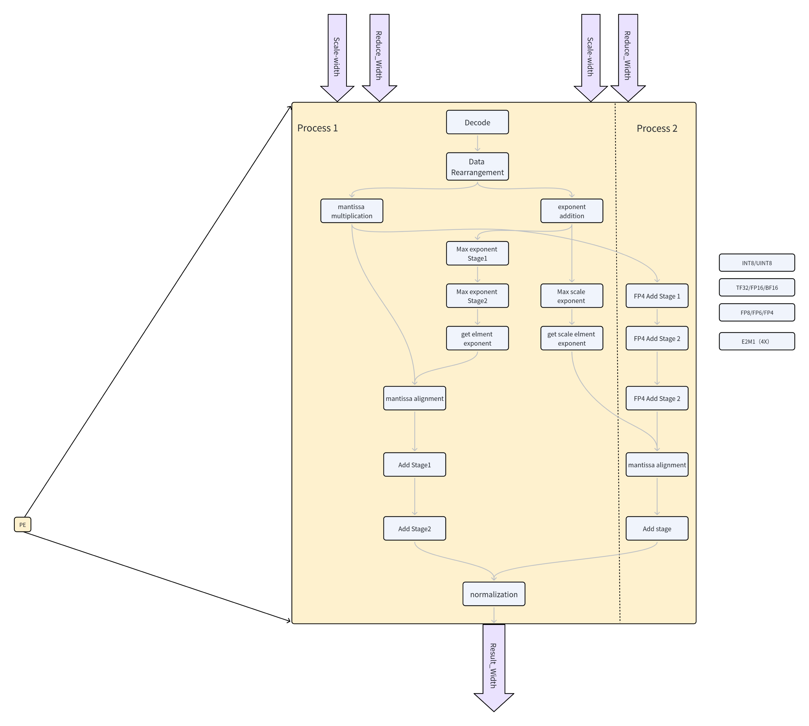

# FPE 浮点运算引擎

## 1. 术语说明

| 术语 | 说明 |
|------|------|
| FPE | Floating-Point Engine，浮点运算引擎，CUTE 中每个 PE 的核心计算逻辑 |
| FReducePE | FPE 的源码实现类名 |
| Flow 1 | 标准多精度计算路径，所有浮点和整数格式统一经过 27-bit 对齐和归约 |
| Flow 2 | E2M1（FP4）专用高吞吐路径，通过 LUT 转定点后绕过对阶逻辑，支持 2X/4X 吞吐量 |
| ReduceWidth | 归约通道位宽（默认 512 bit） |
| CmpTree | 指数比较树，位并行实现，用于浮点对阶时查找最大指数 |
| RawFloat | FPE 内部统一的浮点表示格式，所有数据类型解码后统一为此格式 |
| 保护位（Guard Bit） | 对齐移位时保留的高精度位，防止舍入误差 |
| 粘滞位（Sticky Bit） | 记录对齐移位过程中被丢弃的非零位，用于精确舍入判断 |
| ULP | Unit in the Last Place，最小精度单位 |


## 2. 设计概述

FPE 是 CUTE 中每个 PE 的核心计算逻辑，执行向量内积并累加到 C 矩阵元素上：

```
D[m][n] = Σ_k(A[m][k] × B[k][n]) + C[m][n]
```

对于块缩放数据类型（MXFP/NVFP），有效指数为数据指数与 Scale 因子指数之和，计算公式扩展为：

```
D[m][n] = Σ_k(scale_A[k] × A[m][k] × scale_B[k] × B[k][n]) + C[m][n]
```

### 四阶段逻辑架构

FPE 的执行过程划分为四个核心逻辑阶段。各阶段之间、以及阶段内部的长延迟逻辑（如大位宽加法器、CmpTree）处可灵活插入寄存器，以适配不同的时序目标：



### 双流设计目标

| 设计维度 | Flow 1 | Flow 2 |
|---------|--------|--------|
| 目标格式 | 所有格式统一处理（含 INT8） | E2M1（FP4） |
| 对阶方式 | CmpTree + 27-bit 对齐移位 | 定点转换，绕过对阶 |
| 吞吐量 | 1X（基准） | 2X / 4X |
| Scale 支持 | 是（指数预算中叠加 Scale 因子） | 是 |
| 硬件复用 | 共享对齐寄存器、归约树、乘法器 | 复用 Flow 1 的乘法器和加法器 |

## 3. FPE 参数

FPE 的关键参数定义：

| 参数 | 默认值 | 含义 |
|------|--------|------|
| `MinGroupSize` | 16 | 最小归约分组大小，决定归约树的扇入结构 |
| `MinDataTypeWidth` | 4 | 支持的最小数据类型位宽（对应 FP4） |
| `ScaleElementWidth` | 8 | Scale 因子的元素位宽（FP8 精度） |
| `cmptreelayers` | 4 | CmpTree 在前阶段的比较层数 |
| `fp8cmptreelayers` | 4 | 窄格式 CmpTree 的比较层数 |
| `FP4P0AddNum` | 2 | FP4 阶段 A 的加法器分组数 |

**派生参数：**

| 参数 | 计算公式 | 含义 |
|------|---------|------|
| `P3AddNum` | `ReduceWidth / 4 / MinGroupSize` | 最终归约级加法器数量 |
| `P2AddNum` | `ReduceWidth / (P3AddNum × 16)` | 部分归约每组元素数 |
| `ScaleWidth` | `ReduceWidthByte × 8 × ScaleElementWidth / MinDataTypeWidth / MinGroupSize` | 每 PE 的 Scale 因子位宽 |

## 4. 阶段 A：预处理与解码

阶段 A 负责将不同格式的输入数据统一解码为内部表示，并行完成尾数乘积和指数预算。

### 4.1 多格式解码

根据 `opcode` 将输入向量（ReduceWidth 位宽）并行解码为统一的 `RawFloat` 内部格式。所有数据类型——包括 INT8 ——均转换为 `RawFloat` 格式，后续阶段无需再按数据类型分支。

`RawFloat` 内部表示：

```
RawFloat(expWidth=8, precision=11) {
    sign        : 1 bit         // 符号位
    exp         : SInt(8.W)     // 真实指数（已减去 bias，有符号）
    signed_sig  : SInt(12.W)    // 含隐含 1 的有符号尾数
    exception {
        is_nan  : Bool          // 指数全 1 且尾数非零
        is_inf  : Bool          // 指数全 1 且尾数全零
        is_zero : Bool          // 所有位为零
    }
}
```

**解码方式：**

| 数据类型 | 解码方法 | 关键处理 |
|---------|---------|---------|
| FP16 (E5M10) | 提取 S/E/M，5-bit 指数扩展到 8-bit | 指数真实值不变（bias 自动换算） |
| BF16 (E8M7) | 提取 S/E/M，7-bit 尾数补 3 个零 | 尾数零扩展至 10-bit，保持数值 |
| TF32 (E8M10) | 取 32-bit 字的高 19 bit | 直接使用 |
| FP8 (E4M3/E5M2) | 提取 S/E/M，指数/尾数分别扩展 | 映射到 TF32 精度的内部格式 |
| INT8 | 整数值映射为 RawFloat（尾数 = 整数值，指数 = 0） | 统一进入浮点归约路径 |
| E2M1 (FP4) | LUT 映射为定点整数（Flow 2 路径） | 为高吞吐定点乘法做准备 |

**解码的核心逻辑** `RawFloat.fromUInt`：

- 输入原始 bit 流，参数化 `expWidth` 和 `precision`
- 指数域全零时强制设为 1 后再减 bias，使零和 denormal 的指数不会过小导致后续对阶移位爆炸
- 尾数拼接隐含 1：`Cat(0, nz, mantissa)`，其中 `nz` 表示指数是否非零（即是否为正常数）
- 同步检测 NaN、Inf、Zero 三种异常

### 4.2 双路径并行

**浮点路径：** 所有数据类型的主路径，解码后的 `RawFloat` 送入后续的 27-bit 对齐和归约流程。

**定点路径（Flow 2 专用）：** 针对 E2M1 等极低精度格式，通过查找表（LUT）将有限的离散值映射为定点整数，为后续的高吞吐定点乘加做准备。E2M1 仅用 4 bit（1 sign + 2 exp + 1 mantissa），可表示值域极为有限，适合用查表替代完整的浮点解码。

### 4.3 尾数乘积运算

解码后，对 A 和 B 的尾数执行逐元素乘法。乘法器位宽按最宽格式的需求设计（12 bit × 12 bit），窄格式数据自动通过零扩展适配，无需额外控制。

乘积位宽预留了保护位空间，确保在进入阶段 B 的 27-bit 对齐寄存器前不会丢失有效精度。

### 4.4 指数预算

同步计算每对乘积的有效指数：

```
有效乘积指数 = A.exp + B.exp + A.scale_exp + B.scale_exp
```

对于块缩放格式（MXFP/NVFP），Scale 因子的指数（FP8 E5M2 格式）叠加到数据指数上，使 CmpTree 在比较时能直接找到包含 Scale 效应的最大指数。

指数以**偏移无符号**表示（`真实值 + 255`），使负指数也能用位运算高效比较。零值的乘积指数强制设为 0，避免干扰最大值查找。

### 4.5 异常传播

阶段 A 同步计算每对乘积的异常标志，用于最终结果判定：

| 异常 | 判定条件 |
|------|---------|
| NaN | A_nan ∨ B_nan ∨ (A_inf ∧ B_zero) ∨ (B_inf ∧ A_zero) |
| Zero | (A_zero ∧ ¬B_inf) ∨ (B_zero ∧ ¬A_inf) |
| Inf | (¬A_zero ∧ B_inf) ∨ (¬B_zero ∧ A_inf) |

## 5. 阶段 B：全局对阶与对齐

阶段 B 是浮点运算精度的关键保障，通过比较树和动态移位阵列，将所有乘积对齐到统一的指数基准。

### 5.1 指数收敛（CmpTree）

**目标：** 在全部乘积指数 + C 值指数中找到最大值 `MaxExp`。

**位并行比较策略**：

CmpTree 不使用传统的比较器树，而是采用**位运算掩码**方法：

1. 将所有 9-bit 指数按位排列为 9 组位向量
2. 从最高位（bit 8）开始，逐位生成掩码 `mask`：
   - `mask(0)` = bit8 的非零掩码（保留 bit8=1 的元素位置）
   - `mask(i)` = `mask(i-1) & bit(i)`（取交集，逐步缩小）
3. 若某一层的交集为空，则保留上一层的掩码不变
4. 最终输出 9-bit 编码，每位表示该位在所有有效指数中是否全为 1

**优势：** 全部用位与/或运算实现，不依赖比较器的级联延迟，适合 ASIC 高频实现。

**两级拆分：** 9 层串行掩码可能超出时序预算，拆为两部分跨两个阶段执行：

- **前阶段（cmptreelayers 层）：** 计算前 4 层掩码，输出中间结果
- **后阶段（9 - cmptreelayers 层）：** 接续完成剩余层，输出完整 `MaxExp`

两级之间可插入寄存器，也可根据时序合并为单级执行。

### 5.2 动态偏移计算

```
RightShift[i] = MaxExp - MulExpVec[i]
```

每个乘积需要右移 `RightShift[i]` 位，使尾数对齐到公共指数 `MaxExp`。右移量范围为 0 ~ 511（9-bit）。

### 5.3 27-bit 高精度对齐阵列

**结构：** 使用 33 个 27-bit 寄存器装载对齐后的数据（32 路乘积 + 1 路 C 值）。

**27-bit 位宽构成：**

```
|←—— 23 bit ——→|←1→|←1→|←2→|
   乘积尾数     G   R   Sticky
```

| 位段 | 位宽 | 作用 |
|------|------|------|
| 乘积尾数 | 23 bit | 尾数乘积的有效位（含隐含 1） |
| 保护位（Guard, G） | 1 bit | 对齐移位后保留的最高有效位，防止舍入误差 |
| 舍入位（Round, R） | 1 bit | 用于最终 RNE 舍入判断 |
| 粘滞位（Sticky, S） | 2 bit | 记录移位过程中被丢弃的位是否曾有非零值 |

**精度对齐目标：** 27-bit 对齐宽度通过在 NVIDIA GPU 上的实测验证确定。设计目标是与 NVIDIA RTX 5090 TensorCore 的累加精度达到 **bit 级一致**，确保 CUTE 的计算结果与 GPU 参考实现完全可重复比对。

**对齐过程：**

1. 尾数乘积扩展为 27-bit（低位补零）
2. 根据右移量执行算术右移
3. 被移出的低位更新粘滞位：`sticky |= 被丢弃位中有非零`
4. 右移后的 27-bit 值写入对齐寄存器

## 6. 阶段 C：归约与累加

阶段 C 将 33 路 27-bit 对齐数据通过多级加法树归约为单一求和结果，并叠加 C 值。

### 6.1 符号注入

在归约求和之前，根据每路数据的符号位将 27-bit 尾数转换为补码形式：

```
aligned_signed = Mux(sign, -aligned_unsigned, aligned_unsigned)
```

这样后续的加法树只需处理绝对值相加，最终结果的符号在阶段 D 通过最高位恢复。

### 6.2 多级归约树

**Flow 1 路径：**

33 路 27-bit 数据（32 路乘积 + 1 路 C 值）送入加法树，逐级压缩为单一结果：

```
33 路 27-bit
├── 第 1 级：每组若干元素求和 → 部分和（位宽适当扩展以容纳进位）
├── 第 2 级：部分和继续求和 → 更少的部分和
└── 最终级：全部归约为单一 32-bit 累加结果
```

归约过程中每一级的位宽都会适当扩展，以承载多路数据累加产生的进位，防止溢出。

**Flow 2 路径（E2M1 高吞吐）：**

E2M1 在阶段 A 已通过 LUT 转为定点整数，在此处通过并行的定点加法器处理 2X 或 4X 的数据流。由于定点运算无需对阶移位，Flow 2 直接绕过阶段 B 的 CmpTree 和对齐逻辑，以更短的延迟和更高的吞吐完成归约。

| 模式 | 每周期处理元素数 | 对阶 | 归约方式 |
|------|----------------|------|---------|
| Flow 1 (1X) | 基准 | CmpTree + 27-bit 移位 | 浮点加法树 |
| Flow 2 (2X) | 2X | 无（定点） | 并行定点加法器 |
| Flow 2 (4X) | 4X | 无（定点） | 并行定点加法器 |

### 6.3 C 值合并

C 值与乘积归约结果统一累加。在浮点模式下，C 以 27-bit 对齐后的尾数参与归约；在最终输出为 INT32 时，C 以原始 32-bit 整数直接相加。

## 7. 阶段 D：后处理与规格化

阶段 D 将归约结果转换为标准 FP32 或 INT32 格式输出。

### 7.1 规格化调整

1. **提取符号**：`ResultSign = 累加结果[31]`
2. **取绝对值**：`UnsignedSig = |累加结果|`
3. **前导零检测（CLZ）**：计算 `UnsignedSig` 中前导零个数
4. **指数调整**：`FinalExp = MaxExp - LeadingZeros + 偏移补偿`，将最高有效位对齐到规格化位置
5. **尾数移位**：根据 CLZ 结果左移或右移尾数，使隐含 1 对齐到正确位置

### 7.2 舍入与异常处理

**舍入模式：** 采用 RNE（Round to Nearest, ties to Even）舍入策略，与 NVIDIA TensorCore 的舍入行为一致。利用阶段 B 中保留的 Guard/Round/Sticky 位判定舍入方向：

- G=1 或 (G=0, R=1, S=1)：需要进位
- G=1, R=0, S=0：看尾数最低位，奇数进位、偶数不进位（ties to even）

**异常结果判定：**

| 优先级 | 条件 | 输出值 | 说明 |
|--------|------|--------|------|
| 1（最高） | 存在 NaN，或同时存在 +Inf 和 -Inf | `0x7FC00000` | Quiet NaN |
| 2 | 存在 +Inf（且无 NaN 或 +Inf/-Inf 共存） | `0x7F800000` | 正无穷 |
| 3 | 存在 -Inf（且无更高优先级异常） | `0xFF800000` | 负无穷 |
| 4（最低） | 所有元素均为负零 | `0x80000000` | 负零 |
| — | 无异常 | 正常计算结果 | — |

**溢出/下溢处理：**

| 条件 | 处理 |
|------|------|
| 指数 > 127 | 上溢为 +Inf / -Inf（按符号） |
| 指数 < -126 | 下溢为 0 或 denormal（根据粘滞位判断是否完全为零） |
| 指数 ≤ -149 | 完全下溢为 0 |

### 7.3 结果输出

```
io.out = Mux(整数opcode, INT32 累加结果, Mux(有异常, 异常编码, FP32 规格化结果))
```

- **整数模式**（INT8 等）：直接输出 32-bit 累加结果，跳过所有浮点归一化和异常处理
- **浮点模式**：输出 FP32，遇异常时输出对应编码

## 8. 设计亮点

### 8.1 灵活的流水线切分

阶段 A~D 是逻辑划分，不是严格的时钟周期划分。由于 CmpTree（指数比较树）和加法树（Reduction Tree）逻辑较深，设计中预留了"可插拔"的寄存器插入点：

- **宽松时序**：可将多个阶段合并到同一时钟周期
- **紧凑时序**：在阶段内部进一步拆分（如 CmpTree 的两级拆分、归约树的多级切分）

这种灵活性使 FPE 能够适配不同的工艺库和频率目标。

### 8.2 统一的内部数据结构

通过定义一致的 `RawFloat` 内部格式，**所有数据类型（含 INT8）**在阶段 A 解码后使用相同的数据路径。这使得：

- Flow 1 和 Flow 2 在归约阶段可以复用大量的加法器资源
- 不同数据类型之间切换时无需额外的数据通路选择逻辑
- 简化了验证和测试的复杂度

### 8.3 精度对标与验证

FPE 的对齐精度设计以 **NVIDIA RTX 5090 TensorCore 为参考金标准**，力求达到 bit 级一致（bit-exact match）。验证方法为在 NVIDIA GPU 上运行相同的数据和计算图，逐 bit 对比归约中间结果和最终输出。

> **设计原则**：所有精度相关参数（对齐位宽、舍入模式、Sticky 位宽、异常处理优先级）均以 NVIDIA GPU 实测结果为最终判定依据，而非纯理论推导。

## 9. 硬件复用策略

### 9.1 乘法器复用

12×12 bit 的浮点尾数乘法器在 Flow 2 模式下可被重新视为多个小位宽定点乘法器。E2M1 的乘法精度需求极低（1×1 bit 有效），一个 12×12 乘法器可同时处理多组 E2M1 乘法，实现面积效率最大化。

### 9.2 寄存器复用

33 个 27-bit 对齐寄存器在两种模式下承担不同角色：

| 模式 | 寄存器用途 |
|------|-----------|
| Flow 1 | 存储移位对齐后的浮点尾数 |
| Flow 2 | 作为定点中间和的暂存器，支撑 2X/4X 吞吐量的数据周转 |

### 9.3 加法器树复用

归约加法树是 Flow 1 和 Flow 2 共享的核心资源：
- Flow 1：处理 27-bit 浮点尾数的符号翻转和累加
- Flow 2：处理定点整数的直接累加（无需符号翻转，因为 LUT 已输出有符号值）

## 10. 数据类型支持

| 数据类型 | 编码 | 输入位宽 | 累加精度 | 输出 | Flow |
|---------|------|---------|---------|------|------|
| I8 × I8 → I32 | 0 | 8 bit | INT32 | INT32 | 1 |
| FP16 × FP16 → F32 | 1 | 16 bit | FP32 | FP32 | 1 |
| BF16 × BF16 → F32 | 2 | 16 bit | FP32 | FP32 | 1 |
| TF32 × TF32 → F32 | 3 | 19 bit | FP32 | FP32 | 1 |
| I8 × U8 → I32 | 4 | 8 bit | INT32 | INT32 | 1 |
| U8 × I8 → I32 | 5 | 8 bit | INT32 | INT32 | 1 |
| U8 × U8 → I32 | 6 | 8 bit | INT32 | INT32 | 1 |
| MXFP8 E4M3 × E4M3 → F32 | 7 | 8 bit | FP32 | FP32 | 1 |
| MXFP8 E5M2 × E5M2 → F32 | 8 | 8 bit | FP32 | FP32 | 1 |
| NVFP4 × NVFP4 → F32 | 9 | 4 bit | FP32 | FP32 | 1 |
| MXFP4 × MXFP4 → F32 | 10 | 4 bit | FP32 | FP32 | 1 |
| FP8 E4M3 × E4M3 → F32 | 11 | 8 bit | FP32 | FP32 | 1 |
| FP8 E5M2 × E5M2 → F32 | 12 | 8 bit | FP32 | FP32 | 1 |


## 11. 流水线控制

### 11.1 反压机制

FPE 采用寄存器反压机制控制数据流动。各级之间通过 `AllowIn` 信号传播反压：当后级阻塞时，前级暂停接受新数据，形成全流水线的反压链。

输入/输出接口采用 Decoupled 握手协议：

| 接口 | 方向 | 位宽 | 说明 |
|------|------|------|------|
| `AVector` | Input (Flipped Decoupled) | `ReduceWidth` | A 向量数据 |
| `BVector` | Input (Flipped Decoupled) | `ReduceWidth` | B 向量数据 |
| `CAdd` | Input (Flipped Decoupled) | 32 | C 累加值 |
| `DResult` | Output (Decoupled) | 32 | 归约结果 |
| `opcode` | Input | 3 | 数据类型 / 计算模式选择 |


## 12. 参考

- 源码：`cute-fpe/fpe/src/main/scala/top/FReducePE.scala`（独立验证版本，ReduceWidth=512）
- 源码：`src/main/scala/FReducePE.scala`（集成版本，参数可配）
- 测试金模型：`cute-fpe/ccode/fmac.h`（C++ 参考实现）
- 参数定义：`CUTEParameters.scala:350`（`CuteFPEParams`）、`CUTEParameters.scala:1136`（派生参数）
- 精度基准：NVIDIA RTX 5090 TensorCore（bit-exact 对标验证）
