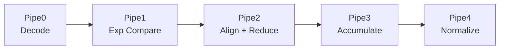

# ReducePE 运算单元

## 1. 术语说明

| 术语 | 说明 |
|------|------|
| FReducePE | Float Reduce Processing Element，支持浮点的归约处理单元 |
| ReduceWidth | 归约通道位宽，默认 512 bit（64 字节） |
| ReduceGroupSize | 归约分组数，`Tensor_K / ReduceWidthByte` |
| CmpTree | 指数比较树，用于浮点对齐 |

> **注意**：`ReducePE.scala` 已被注释废弃，当前使用 `FReducePE.scala` 作为统一的 PE 实现，同时支持整数和浮点运算。

## 2. 设计规格

| 参数 | 含义 | 说明 |
|------|------|------|
| `ReduceWidthByte` | 归约宽度（字节） | 可配置为 32 或 64 字节 |
| `ReduceWidth` | 归约宽度（bit） | `ReduceWidthByte × 8` |
| `ResultWidth` | 输出位宽 | 32 bit（FP32 / INT32） |
| 支持的数据类型 | 13 种 | I8/U8/FP16/BF16/TF32/FP8/MXFP8/MXFP4/NVFP4 等 |

## 3. 功能描述

FReducePE 是 MTE 阵列中的单个处理单元，执行以下操作：

1. **向量内积**：计算 A 向量和 B 向量的逐元素乘积之和
2. **块缩放**：对 MXFP/NVFP 格式，逐块乘以缩放因子后再累加
3. **累加**：将归约结果加上 C 矩阵的对应元素
4. **归一化**：将结果归一化为 FP32 格式输出

**计算公式：**

```
D[m][n] = Σ_k(A[m][k] × B[k][n]) × ScaleA[k] × ScaleB[k] + C[m][n]
```

## 4. 微架构设计

### 4.1 五级流水线详解



#### Pipe0 — Decode（解码）

- **FVecDecoder**：根据 `dataType` 将输入向量解码为内部 TF32 格式
  - 整数类型：零扩展为内部表示
  - 浮点类型：拆分符号/指数/尾数，映射到统一的内部格式
- **乘法启动**：计算相邻元素的尾数积
- **指数比较树 P0**：启动最大指数查找的第一级

#### Pipe1 — Exponent Compare（指数比较）

- 完成最大指数查找（`CmpTreeP1`）
- 计算每个部分积相对于最大指数的右移量
- 处理 MXFP/FP4 等需要额外缩放对齐的格式

#### Pipe2 — Align + Reduce（对齐与归约）

- **对齐**：根据 Pipe1 计算的右移量，将所有尾数对齐到公共指数
- **归约树**：将 `ReduceWidth` 位宽内的所有部分积相加
- **FP4 缩放对齐**：处理块缩放格式中不同分组的对齐

#### Pipe3 — Accumulate（累加）

- 将归约结果与 C 矩阵的尾数值相加
- 处理累加溢出和舍入

#### Pipe4 — Normalize（归一化）

- **CLZ（Count Leading Zeros）**：计算前导零个数
- 指数调整和尾数移位
- 异常处理（上溢、下溢、NaN、Inf）
- 打包为标准 FP32 格式输出

### 4.2 数据类型解码路径

```
输入 dataType
    │
    ├─ 0/4/5/6 (I8/U8) ──→ 零扩展 → 整数乘法 → 整数累加
    │
    ├─ 1 (FP16) ──→ 拆分 E5M10 → 映射到 TF32 尾数
    ├─ 2 (BF16) ──→ 扩展 E8M7 → 映射到 TF32 尾数
    ├─ 3 (TF32) ──→ 直接使用 E8M10
    │
    ├─ 11/12 (FP8 E4M3/E5M2) ──→ 扩展指数和尾数
    │
    └─ 7/8/9/10 (MXFP8/MXFP4/NVFP4) ──→ 解码 → × Scale 因子 → 累加
```

## 5. 数据类型支持

| 数据类型 | 输入位宽 | 乘法精度 | 累加精度 | 输出 |
|---------|---------|---------|---------|------|
| I8×I8→I32 | 8 bit | 整数 | INT32 | INT32 |
| FP16×FP16→F32 | 16 bit | FP16 | FP32 | FP32 |
| BF16×BF16→F32 | 16 bit | BF16 | FP32 | FP32 |
| TF32×TF32→F32 | 19 bit | TF32 | FP32 | FP32 |
| FP8 E4M3 | 8 bit | FP8 | FP32 | FP32 |
| FP8 E5M2 | 8 bit | FP8 | FP32 | FP32 |
| MXFP8 E4M3 | 8 bit+Scale | FP8+缩放 | FP32 | FP32 |
| MXFP8 E5M2 | 8 bit+Scale | FP8+缩放 | FP32 | FP32 |
| MXFP4 | 4 bit+Scale | FP4+缩放 | FP32 | FP32 |
| NVFP4 | 4 bit+Scale | FP4+缩放 | FP32 | FP32 |

## 6. 与其他模块的交互

| 交互模块 | 方向 | 说明 |
|---------|------|------|
| ADataController | → VectorA | 接收 A 矩阵数据 |
| BDataController | → VectorB | 接收 B 矩阵数据 |
| AScaleController | → ScaleA | 接收 A 缩放因子（仅块缩放类型） |
| BScaleController | → ScaleB | 接收 B 缩放因子（仅块缩放类型） |
| CDataController | ← MatrixC | 接收累加初值 |
| CDataController | → MatrixD | 输出计算结果 |

## 7. 参考

- 源码：`src/main/scala/FReducePE.scala`
- 废弃源码：`src/main/scala/ReducePE.scala`（纯整数版本，已废弃）
