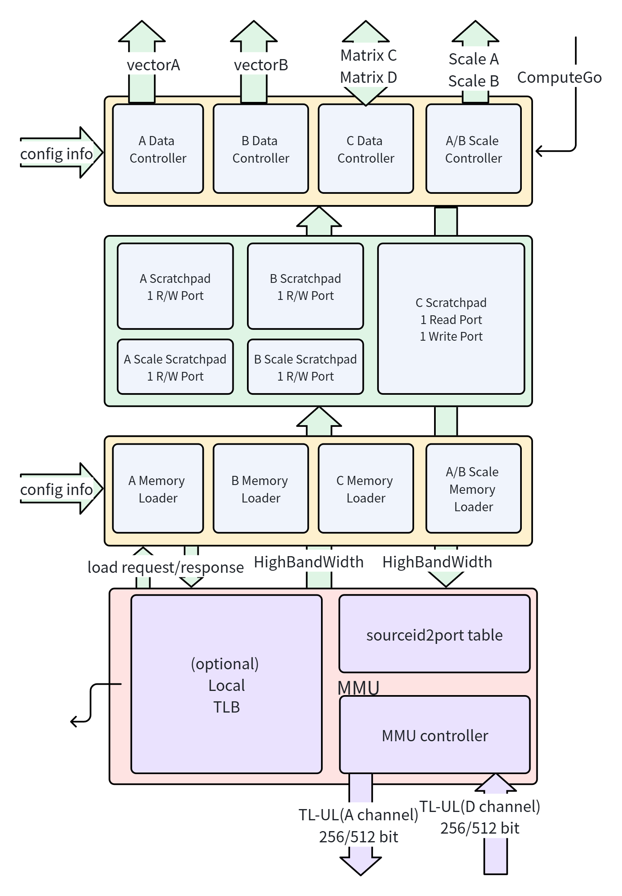

# 存储系统

> **典型配置**：`Tensor_M = Tensor_N = 64`，`Matrix_M = Matrix_N = 4`，`ReduceWidthByte = 64`（ReduceWidth = 512 bit），`Tensor_K = 64`（ReduceGroupSize = 1），`ResultWidthByte = 4`。A/B SCP 各 4 KB，C SCP 16 KB，双缓冲总计 48 KB。

CUTE 的存储系统负责数据在主存与计算引擎之间的搬运，包含 Scratchpad 缓冲、Scale Scratchpad 缓冲、数据流控制、缩放因子控制、内存加载和地址翻译五个层次。所有 Scratchpad 采用双缓冲设计，支持 Load/Compute/Store 流水线重叠执行。

## 模块总览

## 导航

- [A/B/C Scratchpad](scratchpads.md) — 双缓冲片上存储、Bank 结构、读写端口
- [Scale Factor Scratchpad](scale-scratchpads.md) — A/B Scale Scratchpad、块缩放因子存储
- [数据流控制器](data-controllers.md) — ADC/BDC/CDC + ASC/BSC 的状态机、地址生成、Hold Register
- [内存加载器](memory-loaders.md) — AML/BML/CML + ASL/BSL 的请求生成、im2col 变换、SCP Fill Table
- [本地内存管理单元](local-mmu.md) — 5 路轮转仲裁、32 项 TLB、Source ID 管理
