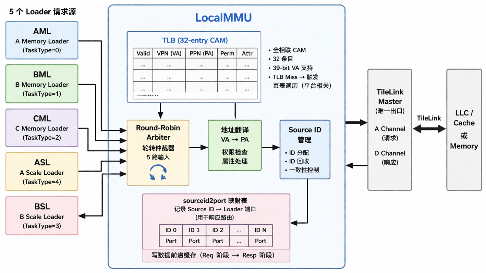

# 本地内存管理单元（LocalMMU）

> **典型配置**：`Tensor_M = Tensor_N = 64`，`Matrix_M = Matrix_N = 4`，`ReduceWidthByte = 64`（ReduceWidth = 512 bit），`Tensor_K = 64`（ReduceGroupSize = 1），`ResultWidthByte = 4`。A/B SCP 各 4 KB，C SCP 16 KB，双缓冲总计 48 KB。

## 1. 术语说明

| 术语 | 说明 |
|------|------|
| LocalMMU | 本地内存管理单元，处理虚拟地址到物理地址的翻译 |
| TLB | Translation Lookaside Buffer，地址翻译缓存 |
| TileLink | RISC-V 芯片内互连总线协议 |
| Source ID | TileLink 事务标识符，用于匹配请求和响应 |

## 2. 设计规格

| 参数 | 说明 |
|------|------|
| TLB 条目数 | 32（CAM 结构） |
| 请求源数量 | 5（AML、BML、CML、ASL、BSL） |
| 仲裁策略 | Round-Robin（轮转） |
| 地址宽度 | 39 bit（虚拟地址） |
| LLC Source ID 数量 | 可配置（默认 64） |
| Memory Source ID 数量 | 可配置（默认 64） |
| TaskType 编码位宽 | 3 bit（`TaskTypeBitWidth = 3`） |
| TaskTypeMax | 5（AFirst=0, BFirst=1, CFirst=2, BScaleFirst=3, AScaleFirst=4） |

## 3. 功能描述

LocalMMU 是 CUTE 访问主存的网关，承担两个核心职责：

1. **地址翻译**：将 Loader 发出的虚拟地址翻译为物理地址
2. **多路仲裁**：将 5 个 Loader 的内存请求合并到单一 TileLink 端口

### 3.1 TLB 地址翻译

- 维护 32 项全相联 CAM 结构的 TLB
- 虚拟地址匹配后输出物理地址
- TLB 未命中时，通过 TileLink 控制通道发起页表遍历（取决于 CPU 平台实现）

### 3.2 5 路轮转仲裁

```
  AML ──→ ┐
  BML ──→ ├─→ Round-Robin Arbiter ──→ 地址翻译 ──→ TileLink Master
  CML ──→ │
  ASL ──→ │
  BSL ──→ ┘
```

5 个 Loader 的请求通过 Round-Robin 仲裁器依次服务，避免任何单一 Loader 饿死其他 Loader。仲裁类型编码：

| 编码 | 名称 | 说明 |
|------|------|------|
| 0 | `AFirst` | A MemoryLoader |
| 1 | `BFirst` | B MemoryLoader |
| 2 | `CFirst` | C MemoryLoader |
| 3 | `BScaleFirst` | B ScaleLoader |
| 4 | `AScaleFirst` | A ScaleLoader |

### 3.3 Source ID 管理

- 一致性请求使用 LLC Source ID 范围
- 非一致性请求使用 Memory Source ID 范围
- `sourceid2port` 寄存器阵列记录每个 Source ID 对应的请求来源，用于响应路由
- 写数据从请求阶段前递到响应阶段

## 4. 微架构设计



## 5. 与其他模块的交互

| 交互模块 | 方向 | 说明 |
|---------|------|------|
| AMemoryLoader | ←→ | A 矩阵加载请求/响应 |
| BMemoryLoader | ←→ | B 矩阵加载请求/响应 |
| CMemoryLoader | ←→ | C 矩阵加载和 D 结果存储 |
| AScaleLoader | ←→ | A 缩放因子加载请求/响应 |
| BScaleLoader | ←→ | B 缩放因子加载请求/响应 |
| LLC/Cache | ←→ | TileLink 总线（唯一出口） |

## 6. 参考

- 源码：`src/main/scala/LocalMMU.scala`
- 任务类型定义：`LocalMMUTaskType`（`CUTEParameters.scala`）
