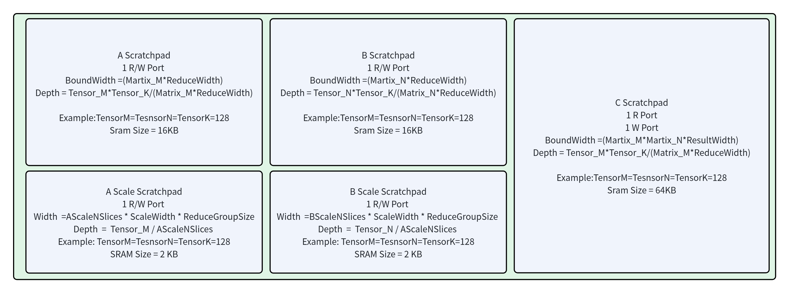

# A/B/C Scratchpad

## 1. 术语说明

| 术语 | 说明 |
|------|------|
| Scratchpad (SCP) | 片上暂存存储器，用于缓存矩阵 tile 数据 |
| Bank | 存储分体，使用独立 `SyncReadMem` 实例，支持并行读写 |
| 双缓冲 | 所有 SCP 实例化 ×2，Load 和 Compute 阶段交替使用不同 SCP 组 |
| 写优先 | 当写请求（来自 Loader）和读请求（来自 DataController）同时到达时，写操作优先执行 |
| SCP Fill Table | Loader 端的缓冲结构，将宽总线响应拆分为多次窄 SCP 写入 |

## 2. 设计规格

### 2.1 A Scratchpad

| 参数 | 值（默认配置） | 说明 |
|------|---------------|------|
| 实例数 | 2（双缓冲：SCP[0] 和 SCP[1]） | |
| Bank 数 | `Matrix_M` = 4 | 每个 Bank 对应一个 PE 行 |
| 每个 Bank 位宽 | `ReduceWidthByte × 8` = 512 bit | 一次读出一行 Reduce 向量 |
| 每个 Bank 深度 | `Tensor_M/Matrix_M × ReduceGroupSize` = 32 | `AScratchpadBankNEntrys` |
| 总容量 | `Tensor_M × ReduceGroupSize × ReduceWidthByte` = 128×1×64 = **8 KB** | |
| 总读带宽 | `Matrix_M × ReduceWidthByte × 8` = 2048 bit | 所有 Bank 同时读出 |
| 零填充 | 支持 | 卷积 im2col 越界时通过 ZeroFill 端口写入零值 |

### 2.2 B Scratchpad

| 参数 | 值（默认配置） | 说明 |
|------|---------------|------|
| 实例数 | 2（双缓冲） | |
| Bank 数 | `Matrix_N` = 4 | 每个 Bank 对应一个 PE 列 |
| 每个 Bank 位宽 | `ReduceWidthByte × 8` = 512 bit | |
| 每个 Bank 深度 | `Tensor_N/Matrix_N × ReduceGroupSize` = 32 | |
| 总容量 | `Tensor_N × ReduceGroupSize × ReduceWidthByte` = 128×1×64 = **8 KB** | |
| 总读带宽 | `Matrix_N × ReduceWidthByte × 8` = 2048 bit | |
| 零填充 | 不支持 | B 矩阵不做 im2col 变换 |

### 2.3 C Scratchpad

| 参数 | 值（默认配置） | 说明 |
|------|---------------|------|
| 实例数 | 2（双缓冲） | |
| Bank 数 | `Matrix_N` = 4 | 方便 reorder |
| 每个 Bank 位宽 | `Matrix_M × ResultWidthByte × 8` = 128 bit | 一个 entry 存一整行 M 的结果 |
| 每个 Bank 深度 | `Tensor_M × Tensor_N / (Matrix_N × Matrix_M)` = 1024 | |
| 总容量 | `Tensor_M × Tensor_N × ResultWidthByte` = 128×128×4 = **64 KB** | |
| 总读带宽 | `Matrix_N × Matrix_M × ResultWidthByte × 8` = 512 bit | |
| 端口 | 独立读写端口 | CDC 和 CML 可同时读写不同 Bank |

## 3. Bank 结构与对齐原理

### 3.1 A SCP 的 Bank 划分

A SCP 按 **M 维度** 切分为 `Matrix_M` 个 Bank。AML 写入时按 `BankId = M % Matrix_M` 分配 Bank，按 `Addr = (M / Matrix_M) × ReduceGroupSize + K` 分配 Bank 内地址。

| Bank 内地址 | Bank[0] | Bank[1] | Bank[2] | Bank[3] |
|:-----------:|:-------:|:-------:|:-------:|:-------:|
| 0 | M=0, K=0 | M=1, K=0 | M=2, K=0 | M=3, K=0 |
| 1 | M=4, K=0 | M=5, K=0 | M=6, K=0 | M=7, K=0 |
| ... | ... | ... | ... | ... |
| 31 | M=124, K=0 | M=125, K=0 | M=126, K=0 | M=127, K=0 |

ADC 读取时向所有 Bank 发送**相同地址**，同时读出 4 个 Bank 的数据，拼接得到 4 个 M 行 × `ReduceWidth` bit 的向量——这正是 MTE 的 VectorA 所需的数据格式。

**为什么必须 Bank 数 = Matrix_M？**

因为 MTE 的计算阵列是 `Matrix_M × Matrix_N` 的二维 PE 阵列，每一行 PE 需要同一 M 行的 A 数据，不同行 PE 需要不同 M 行的 A 数据。ADC 每周期向 MTE 提供一组 `Matrix_M` 行的 A 向量，要求 SCP 在一个读周期内同时输出 `Matrix_M` 个 entry。因此 Bank 数必须等于 `Matrix_M`，且每个 Bank 存放不同 M 行的数据，读地址相同时各 Bank 输出不同 M 行。

### 3.2 B SCP 的 Bank 划分

B SCP 按 **N 维度** 切分为 `Matrix_N` 个 Bank，结构与 A SCP 完全对称。

| Bank 内地址 | Bank[0] | Bank[1] | Bank[2] | Bank[3] |
|:-----------:|:-------:|:-------:|:-------:|:-------:|
| 0 | N=0, K=0 | N=1, K=0 | N=2, K=0 | N=3, K=0 |
| 1 | N=4, K=0 | N=5, K=0 | N=6, K=0 | N=7, K=0 |
| ... | ... | ... | ... | ... |

BDC 读出 `Matrix_N` 个 N 列的 B 向量，供给 MTE 的 VectorB。

### 3.3 C SCP 的 Bank 划分

C SCP 按 **N 维度** 切分为 `Matrix_N` 个 Bank，但 **Entry 宽度** 与 A/B SCP 不同：

- A/B SCP Entry = `ReduceWidthByte`（默认 64B）：存一行的 Reduce 向量
- C SCP Entry = `Matrix_M × ResultWidthByte`（默认 16B）：存一整列的 M 个结果

| Bank 内地址 | Bank[0] | Bank[1] |
|:-----------:|:-------:|:-------:|
| 0 | M=0..3, N=0..3 | M=0..3, N=4..7 |
| 1 | M=4..7, N=0..3 | M=4..7, N=4..7 |
| 2 | M=8..11, N=0..3 | M=8..11, N=4..7 |
| ... | ... | ... |
| 1023 | M=124..127 | M=124..127 |

> 每个 entry = `Matrix_M × ResultWidthByte` = 16B = 4 个 FP32

CDC 一次读出 `Matrix_N` 个 Bank，得到 `Matrix_N` 组 `Matrix_M` 个结果（共 `Matrix_M × Matrix_N × ResultWidth` bit），覆盖整个 PE 阵列的累加初值。

### 3.4 读地址计算（DataController 端）

ADC 的读地址公式（`ADataController.scala` 第 151 行）：

`addr = M_Iterator × K_IteratorMax + K_Iterator`

所有 Bank 使用相同地址。以 `M_Iterator=0, K_Iterator=0` 为例，Bank[0] 输出 `M=0,K=0`，Bank[1] 输出 `M=1,K=0`，...，Bank[3] 输出 `M=3,K=0`。

BDC 读地址公式：`addr = N_Iterator × K_IteratorMax + K_Iterator`

## 4. 写优先仲裁

所有 SCP 使用单端口 `SyncReadMem`，通过写优先逻辑解决读写冲突（`AScratchpad.scala` 第 51-52 行）：

```scala
write_go = (任意 Bank 的写 valid) || (任意 Bank 的 ZeroFill valid)
read_go  = DataController.BankAddr.valid && !write_go
```

**设计原理**：

- Loader 写入来自外部总线（慢速），DataController 读取供给 MTE（快速）
- 如果写操作被阻塞，数据可能丢失（外部总线不会重发）
- 读操作被阻塞仅导致 DataController 多等一拍（使用 Hold Register 暂存已读数据）
- 因此写优先是正确的策略

A/B SCP 使用 `bank.readWrite(addr, data, enable, isWrite)` 接口实现单周期读写（写同时可以读，但读出的是旧数据）。C SCP 使用独立的 `bank.read()` 和 `bank.write()` 接口（因为 C SCP 有独立的读写端口，来自 CDC 和 CML）。

## 5. 双缓冲机制

每个 SCP 类型（A/B/C）各有两套实例。TaskController 通过 `SCPControlInfo` 信号选择当前活跃的一组：

```
当 Compute 阶段使用 SCP[0] 进行计算时：
  → Load 阶段可以同时向 SCP[1] 写入下一个 tile 的数据
  → Store 阶段可以从 SCP[0] 读取当前 tile 的 D 结果

时间线：
  Cycle 0..T:     SCP[0] = Load A/B/C, SCP[1] = (空闲)
  Cycle T..2T:    SCP[0] = Compute,    SCP[1] = Load  ← 流水重叠
  Cycle 2T..3T:   SCP[0] = Store,      SCP[1] = Compute + Load SCP[0]
  ...
```

## 6. 零填充（仅 A SCP）

A SCP 提供 `ZeroFill` 端口（`AScratchpad.scala` 第 88-91 行），每个 Bank 各一路：

```
ZeroFill[i].valid = true  → Bank[i] 写入地址 ZeroFill[i].bits，数据 = 0
```

当 im2col 窗口越界时，AML 通过此端口直接将 SCP 对应位置填零，无需经过内存加载。

## 7. 微架构设计



## 8. 与其他模块的交互

| SCP 类型 | 写入方 | 读取方 |
|---------|--------|--------|
| A SCP[i] | AMemoryLoader（Load 数据 + ZeroFill） | ADataController |
| B SCP[i] | BMemoryLoader | BDataController |
| C SCP[i] | CMemoryLoader (加载) / CDataController (写回) | CDataController (读取) / CMemoryLoader (存储) |

## 9. 参考

- 源码：`src/main/scala/AScratchpad.scala`、`src/main/scala/BScratchpad.scala`、`src/main/scala/CScratchpad.scala`
- 参数定义：`src/main/scala/CUTEParameters.scala` 第 878-1007 行
