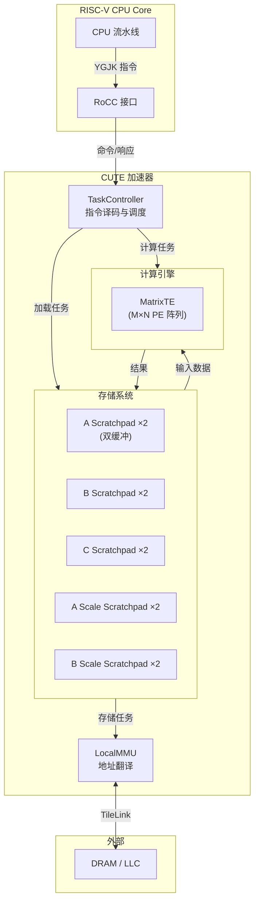

# 整体架构总览

## 1. 系统定位

CUTE 作为 RISC-V 处理器的 RoCC 协处理器工作，位于 CPU 核内部，通过 TileLink 总线访问主存。



## 2. 四大子系统

| 子系统 | 核心模块 | 职责 |
|--------|---------|------|
| **控制逻辑** | TaskController, CUTE2YGJK | 接收 CPU 指令，分解为微任务，调度执行 |
| **存储系统** | Scratchpads, DataControllers, MemoryLoaders, LocalMMU | 数据搬运、缓冲、地址翻译 |
| **计算引擎** | MatrixTE, FReducePE, AfterOps | 矩阵乘法运算和后处理 |
| **接口集成** | CUTE2YGJK, Cute2TL | RoCC 协议适配、TileLink 总线接口 |

## 3. 三阶段执行流水线

CUTE 的计算采用 **Load → Compute → Store** 三阶段流水线，支持跨 tile 重叠执行：

```mermaid
gantt
    title CUTE 三阶段流水线执行时序
    dateFormat X
    axisFormat %s

    section Tile 0
    Load A/B/C 到 SCP0      :l0, 0, 3
    MTE 计算 (SCP0 数据)     :c0, 3, 5
    Store D 到主存            :s0, 5, 7

    section Tile 1
    Load A/B/C 到 SCP1      :l1, 3, 6
    MTE 计算 (SCP1 数据)     :c1, 6, 8
    Store D 到主存            :s1, 8, 10

    section Tile 2
    Load A/B/C 到 SCP0      :l2, 6, 9
    MTE 计算 (SCP0 数据)     :c2, 9, 11
    Store D 到主存            :s2, 11, 13
```



**双缓冲机制**：所有 Scratchpad 均实例化 ×2，当前 tile 的 Compute 阶段使用 SCP[0] 的数据时，下一个 tile 的 Load 阶段同时向 SCP[1] 写入新数据。TaskController 通过 `SCPControlInfo` 信号交替选择 Scratchpad 组。

## 4. 数据流路径

```
CPU 发送 YGJK 配置指令
  → TaskController 组装 MacroInst
  → TaskController 分解为 Load/Compute/Store 微指令三元组

[Load Phase]
  AMemoryLoader → LocalMMU → TileLink → DRAM
  AMemoryLoader → A Scratchpad[i] (写入)
  BMemoryLoader → B Scratchpad[i] (写入)
  CMemoryLoader → C Scratchpad[i] (写入或清零)
  AScaleLoader → A Scale Scratchpad[i] (写入)
  BScaleLoader → B Scale Scratchpad[i] (写入)

[Compute Phase]
  ADataController ← A Scratchpad[i] (读取)
  BDataController ← B Scratchpad[i] (读取)
  CDataController ← C Scratchpad[i] (读取累加值)
  AScaleController ← A Scale Scratchpad[i] (读取缩放因子)
  BScaleController ← B Scale Scratchpad[i] (读取缩放因子)
      ↓
  MatrixTE (M×N 个 FReducePE 并行计算)
      ↓
  CDataController → AfterOps → C Scratchpad[i] (写回结果)

[Store Phase]
  CMemoryLoader ← C Scratchpad[i] (读取结果)
  CMemoryLoader → LocalMMU → TileLink → DRAM
```

## 5. 关键参数总表

| 参数 | 含义 | 默认值 | 说明 |
|------|------|--------|------|
| `Tensor_M` | 输出矩阵行方向的 tile 大小 | 128 | 决定 A Scratchpad 容量 |
| `Tensor_N` | 输出矩阵列方向的 tile 大小 | 128 | 决定 B/C Scratchpad 容量 |
| `Tensor_K` | 归约维度 tile 大小 | 64 | 决定每次计算 K 方向的循环次数 |
| `Matrix_M` | PE 阵列行数 | 4 | 计算吞吐：`Matrix_M × Matrix_N` 个 PE |
| `Matrix_N` | PE 阵列列数 | 4 | |
| `ReduceWidthByte` | 每个归约通道的字节宽度 | 64 | 影响 PE 内部运算宽度 |
| `outsideDataWidth` | 外部总线数据宽度 (bit) | 512 | TileLink 接口位宽 |
| `VectorWidth` | 向量运算宽度 (bit) | 256 | |
| `MemoryDataWidth` | 内存数据宽度 (bit) | 64 | |

## 6. 性能配置预设

CUTE 提供多种性能等级的预设配置：

| 配置名 | Matrix_M | Matrix_N | ReduceWidthByte | 估算性能 |
|--------|----------|----------|-----------------|---------|
| `CUTE_32Tops` | 16 | 16 | 32 | 32 TOPS |
| `CUTE_16Tops` | 8 | 8 | 64 | 16 TOPS |
| `CUTE_8Tops` | 8 | 8 | 32 | 8 TOPS |
| `CUTE_4Tops` | 4 | 4 | 64 | 4 TOPS |
| `CUTE_2Tops` | 4 | 4 | 32 | 2 TOPS |
| `CUTE_1Tops` | 2 | 2 | 64 | 1 TOPS |
| `CUTE_05Tops` | 2 | 2 | 32 | 0.5 TOPS |

还有带 `SCP` 后缀的变体（如 `CUTE_4Tops_128SCP`），修改了 `Tensor_M/N/K` 的 tile 尺寸。

## 7. 支持的数据类型

CUTE 支持 13 种数据类型，编码为 4-bit 字段：

| 编码 | 类型 | 输入 A | 输入 B | 累加/输出 | 说明 |
|------|------|--------|--------|----------|------|
| 0 | I8×I8→I32 | INT8 | INT8 | INT32 | 整数量化推理 |
| 1 | F16×F16→F32 | FP16 | FP16 | FP32 | 半精度浮点 |
| 2 | BF16×BF16→F32 | BF16 | BF16 | FP32 | 脑浮点（训练常用） |
| 3 | TF32×TF32→F32 | TF32 | TF32 | FP32 | TensorFloat-32 |
| 4 | I8×U8→I32 | INT8 | UINT8 | INT32 | 混合符号 |
| 5 | U8×I8→I32 | UINT8 | INT8 | INT32 | 混合符号 |
| 6 | U8×U8→I32 | UINT8 | UINT8 | INT32 | 无符号整数 |
| 7 | MXFP8E4M3 | MXFP8 | MXFP8 | FP32 | 微缩放 FP8（4-bit 指数） |
| 8 | MXFP8E5M2 | MXFP8 | MXFP8 | FP32 | 微缩放 FP8（5-bit 指数） |
| 9 | NVFP4 | FP4 | FP4 | FP32 | NVIDIA FP4 |
| 10 | MXFP4 | MXFP4 | MXFP4 | FP32 | 微缩放 FP4 |
| 11 | FP8E4M3 | FP8 | FP8 | FP32 | 标准 FP8（4-bit 指数） |
| 12 | FP8E5M2 | FP8 | FP8 | FP32 | 标准 FP8（5-bit 指数） |
