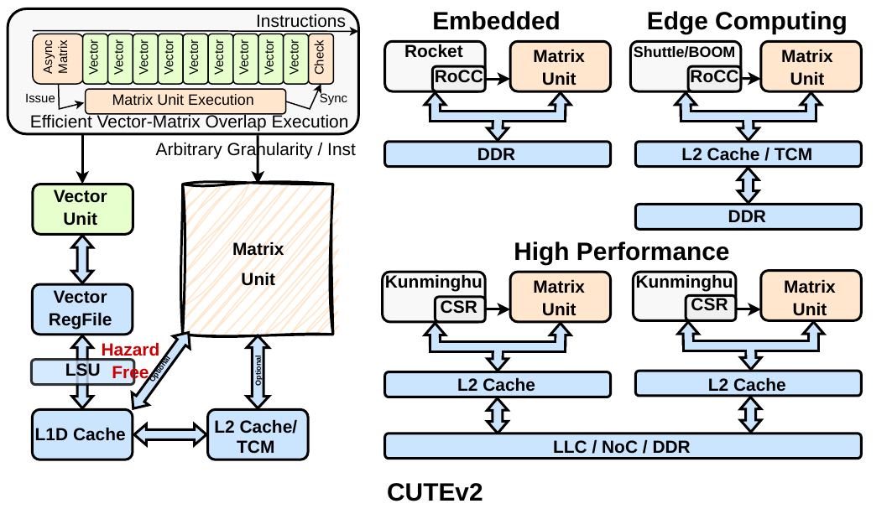

# 项目背景与目标

## 1. 概述

CUTE 的三个核心设计原则：

1. **结构性解耦** — 矩阵单元与 CPU 主流水线解耦，无需对译码器、发射逻辑、寄存器堆或访存单元做侵入式修改
2. **灵活可配置** — 微架构参数可调，适配从嵌入式到高性能 CPU 的不同算力需求和访存约束（0.5 ~ 32 TOPS）
3. **异步编程抽象** — 仅定义异步矩阵乘法指令和同步指令，形成极简统一接口，支持任意粒度的矩阵-向量交叠执行

CUTE 支持 RoCC 和 CSR 两种接口方式与 CPU 通信，通过独立的访存通路（TileLink）访问缓存或主存。软件通过异步矩阵乘法编程模型描述任务，CPU 可在矩阵运算期间继续执行向量操作，实现矩阵-向量交叠执行。

## 2. 核心设计原则

CPU 矩阵扩展的根本目标是在两个维度上同时做到极致：**高性能**与**低集成代价**。高性能要求矩阵单元提供充足的算力、支持丰富的数据精度、并能与 CPU 向量单元协同工作以消除流水线空泡；低集成代价则要求矩阵单元的加入不侵入 CPU 核心微架构，且接口简洁、可参数化以适配多种平台。

CUTE 围绕这两个维度展开设计：

| 设计要点 | 为高性能 | 为低集成代价 |
|---------|---------|------------|
| **解耦集成** | 矩阵单元拥有独立访存通路与 Scratchpad，消除与 CPU 流水线的结构竞争 | 通过 RoCC/CSR 接口挂载，集成仅需 200-500 行 RTL，无需修改译码器、寄存器堆或访存单元 |
| **异步指令** | `asyncMatMul` + `checkMatMul` 两类指令即可覆盖全部矩阵运算语义 | 极简 ISA 扩展，灵活使用ROCC指令槽，不扰动原有指令编码空间 |
| **灵活配置** | PE 阵列规模、Scratchpad 容量、总线位宽均可按算力需求（0.5-32 TOPS）调整 | 同一 RTL 通过参数化适配从嵌入式到高性能的不同 CPU，无需重新设计 |
| **多精度计算** | 13 种数据类型（FP8/INT8/FP16/BF16/TF32/MXFP 等），充分挖掘数据精度与吞吐的权衡 | 数据类型由矩阵单元内部处理，CPU 侧无需感知精度细节 |
| **矩阵-向量交叠** | 异步模型天然支持向量单元在矩阵运算期间执行 epilogue，各负载超过 30% 性能增益 | 交叠由编程模型自然表达，不需要硬件新增额外同步或调度机制 |

## 3. 性能亮点

| 指标 | 数据 |
|------|------|
| GEMM 利用率 | 所有集成平台 > 90% |
| ResNet50 推理（vs Intel AMX） | 1.57x 加速 |
| BERT 推理（vs Intel AMX） | 1.57x 加速 |
| Llama3 推理（vs Intel AMX） | 2.31x 加速 |
| 矩阵-向量交叠贡献 | 各负载超过 30% 性能增益 |
| 面积（4 TOPS@2GHz，14nm） | 0.53 mm² |

## 4. 已集成的 CPU 平台

| CPU | 微架构 | 接口 | 集成代码量 | 集成时间 |
|-----|--------|------|-----------|---------|
| Rocket | 顺序单发射 | RoCC | 254 行 | 3 天 |
| Shuttle | 顺序 3 发射 | RoCC | 512 行 | 5 天 |
| BOOM | 乱序 4 发射 | RoCC | 301 行 | 3 天 |
| 香山·昆明湖 | 乱序 6 发射 | CSR | 361 行 | 3 周 |

## 5. 相关论文

- [CUTE v1: A scalable CPU-centric and Ultra-utilized Tensor Engine for convolutions](https://www.sciencedirect.com/science/article/pii/S1383762124000432)
- [CUTE v2: DAC 2026](https://arxiv.org/abs/2604.11615) — 统一可配置的 CPU 矩阵扩展架构
