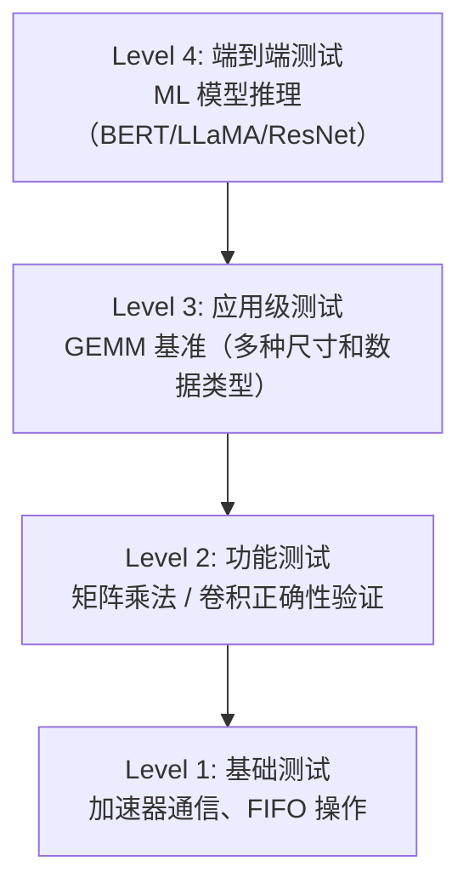

# 测试框架设计

## 1. 术语说明

| 术语 | 说明 |
|------|------|
| Verilator | 开源 Verilog 仿真器，将 Verilog 编译为 C++ 执行 |
| DRAMSim2 | DRAM 周期精确仿真器，模拟真实内存延迟和带宽 |
| Tile 分块 | 将大矩阵划分为 SCP 容量范围内的子矩阵逐步计算 |
| MacroInst | 宏指令，描述一次完整矩阵乘法或卷积任务 |
| 宏指令融合 | 将多个小任务合并为一条宏指令，减少 CPU-加速器交互开销 |
| TCM | Tightly Coupled Memory，紧耦合内存 |

## 2. 测试架构总览

CUTE 采用以应用场景驱动的测试架构，从基础功能验证到端到端 ML 模型推理共四个层级：



## 3. 测试层级详解

### Level 1: 基础测试

**定位：** 验证 CPU 与 CUTE 之间的基本通信和状态查询功能。

**测试目录：** `cutetest/base_test/`

| 测试 | 说明 |
|------|------|
| `cutehello.c` | 加速器通信验证：发起一次卷积运算，验证 FIFO 状态和完成信号 |
| FIFO 状态查询 | 验证 `fifo_valid_search`、`fifo_full_search`、`fifo_finish_search` |
| 性能计数器 | 验证运行时间（funct 2）、读写请求计数（funct 3/4）、计算周期（funct 5） |

### Level 2: 功能测试

**定位：** 验证矩阵乘法和卷积运算的正确性。

**测试目录：** `cutetest/base_test/`

| 测试 | 说明 |
|------|------|
| `cute_Matmul_mnk_128_128_128_zeroinit.c` | 128×128×128 FP16 矩阵乘法（零初始化累加器） |
| `cute_conv_mnk_49_128_128_k1_s1_oh7.c` | 卷积运算（kernel 1×1，stride 1） |
| `get_matrix_test.c` | 矩阵测试数据生成工具 |
| `get_conv_test.c` | 卷积测试数据生成工具 |

**验证方式：** 测试数据以 C 头文件形式编译进二进制，仿真后通过 `compare_result.py` 与参考输出比对。

### Level 3: 应用级测试（GEMM 基准）

**定位：** 使用多种矩阵尺寸和数据类型验证加速器的功能和性能。

**测试目录：** `cutetest/gemm_test/`

每个测试包含 C 源文件（`.c`）、编译后的 RISC-V 二进制（`.riscv`）、反汇编文件（`.dump`）和参考模型（`compare_result.py`）。

**典型测试矩阵：**

| 矩阵尺寸 | M | N | K | 说明 |
|---------|---|---|---|------|
| 小矩阵 | 256 | 256 | 64 | 单 tile 内计算 |
| 中等矩阵 | 512 | 512 | 256 | 多 tile 计算 |
| 大 K 矩阵 | 512 | 512 | 1024 | K 维度远大于 tile |
| 长尾 K | 512 | 512 | 10496/10752/11008 | 模拟 LLaMA 层的 K 维度 |

### Level 4: 端到端测试（ML 模型推理）

**定位：** 验证完整 ML 模型在 CUTE 上的推理正确性和性能。

#### BERT 推理测试

**目录：** `cutetest/transformer_test/bert/`

| 测试 | 说明 |
|------|------|
| `ibert_1.c` | BERT 推理（基本版本） |
| `ibert_2.c` | BERT 推理（优化版本） |
| `ibert_2_notcm.c` | 不使用 TCM 的 BERT 推理 |
| `ibert_2_seg.c` | 分段执行的 BERT 推理 |
| `ibert_2_softpipe.c` | 软件流水线 BERT 推理 |
| `check_transformer.py` | 结果验证脚本 |
| `golden_cute.py` | Golden model 生成 |

#### LLaMA3 推理测试

**目录：** `cutetest/transformer_test/llama/`

| 测试 | 说明 |
|------|------|
| `llama3_1B_10.c` | LLaMA3 1B 模型第 10 层 |
| `llama3_1B_10_nofuse.c` | 同上（不使用宏指令融合） |
| `llama3_1B_10_notcm.c` | 同上（不使用 TCM） |
| `llama3_1B_11.c` ~ `llama3_1B_70+.c` | 更多层的测试 |
| `gloden/` | 各层 Golden 结果 |

每个测试提供三种变体用于对比：
- **默认版本**：使用宏指令融合 + TCM
- **nofuse 版本**：不使用宏指令融合（每条指令单独发送）
- **notcm 版本**：不使用 TCM（Tightly Coupled Memory）

#### ResNet50 卷积测试

**目录：** `cutetest/resnet50_test/`

| 测试 | 说明 |
|------|------|
| `vec_ops_conv_*.c` | 各卷积层的向量运算 |
| `conv_1.h` ~ `conv_50+.h` | ResNet50 各层参数和测试数据 |
| `compare_result.py` | 结果验证脚本 |

## 4. 测试基础设施

### 4.1 构建系统

| 脚本 | 说明 |
|------|------|
| `scripts/build-verilog.sh` | Chisel → Verilog 生成 |
| `scripts/build-simulator.sh` | Verilator 仿真器编译 |
| `scripts/run-simulator-test.sh` | 运行仿真测试 |
| `scripts/run-simulator-test-with-fst.sh` | 运行仿真并生成 FST 波形 |
| `scripts/build-test.sh` | 编译测试程序 |
| `scripts/generate-headers.sh` | 生成测试数据头文件 |

### 4.2 RISC-V 工具链

```
工具链路径：tool/riscv/
架构：rv64imafdcv
ABI：lp64d
编译器：riscv64-unknown-elf-gcc
```

编译选项：
```makefile
CFLAGS = -std=gnu99 -g -fno-common -fno-builtin-printf -Wall -O3
ARCHFLAGS = -march=rv64imafdcv -mabi=lp64d
LDFLAGS = -static -specs=htif_nano.specs
```

### 4.3 执行流程

```
C 源码 (.c)
    ↓ riscv64-unknown-elf-gcc
RISC-V 二进制 (.riscv)
    ↓
Verilator 仿真器
    ↓ DRAMSim2 模拟内存
仿真输出（UART 日志 + 性能计数器）
    ↓ compare_result.py / golden_cute.py
测试通过/失败
```

### 4.4 结果验证

| 验证方式 | 脚本 | 说明 |
|---------|------|------|
| 参考模型比对 | `compare_result.py` | 比较仿真输出与 Python 参考模型的差异 |
| Golden 结果比对 | `golden_cute.py` | 预先生成的 Golden 结果直接比对 |

## 5. 性能分析框架

CUTE 提供 4 级自顶向下性能分析方法论（详见 `scripts/PERFORMANCE_ANALYSIS_GUIDE.md`）：

| 级别 | 名称 | 关键指标 |
|------|------|---------|
| Level 1 | 系统级 | 总周期数、吞吐量、平均每条宏指令周期 |
| Level 2 | 阶段级 | Config/Load/Compute/Store/Stall 各阶段占比 |
| Level 3 | 组件级 | AML/BML/CML 负载平衡、MMU 停顿率、SCP 利用率 |
| Level 4 | 微操作级 | 计算效率、内存绑定度、并行度 |

分析工具：`scripts/perf_analysis.py`

## 6. 参考

- 测试目录：`cutetest/`
- 性能分析指南：`scripts/PERFORMANCE_ANALYSIS_GUIDE.md`
- 驱动接口：`cutetest/base_test/ygjk.h`、`cutetest/base_test/cuteMarcoinstHelper.h`
